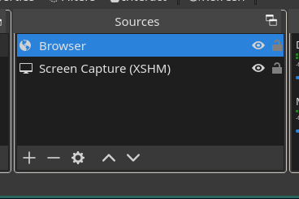
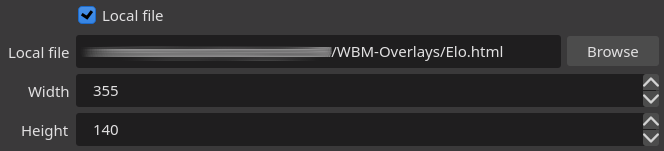
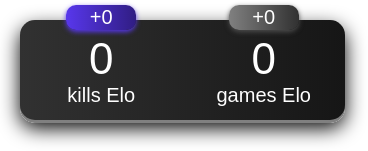

# WBM-Overlays

## Usage

1. [Download](https://github.com/War-Brokers-Mods/WBM-Overlays/archive/refs/heads/master.zip) and unzip the overlays.
2. Create a new browser source in OBS studio.

   

3. Check the `Local file` checkbox and use a `.html` file of the overlay you want to use. Width and height of the overlays can be found [here](#obs-overlays).

   

## Overlays

- kills and games Elo (size: 355x140)

## Special thanks

- [inorganik](https://github.com/inorganik) for [countUp.js](https://github.com/inorganik/countUp.js)
- [jassper0](https://github.com/jassper0) for [Elo overlay design](https://github.com/l3lackShark/static/tree/master/Simplistic)

## License

The source code of this project is available under the MIT License.
